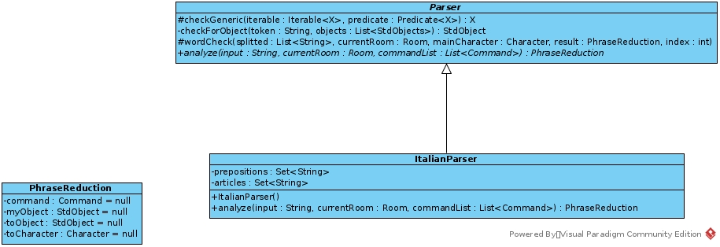

# RELAZIONE
### Introduzione
Lo scopo di questo progetto è stato quello di realizzare un software in grado di giocare avventure testuali.  
Il software infatti è in grado di riprodurre qualsiasi avventura testuale che rispetti la struttura della classe ***"GenericGame"***  

Una volta completata la parte di codice relativa alla gestione di una qualsiasi avventura testuale, ho poi creato la mia particolare avventura
di cui potrete scoprire di più giocandola.

Ci tengo a dire che l'avventura realizzata (TryToStudy, TTS) è molto semplice (i comandi utilizzabili in fin dei conti sono abbastanza limitati) in quanto ho dato priorità
all'utilizzo del maggior numero di tecniche/strumenti di Java e OOP che ci sono stati spiegati durante il corso di MAP.

### Architettura del sistema e UML
Di seguito vedremo alcuni diagrammi delle classi che ci aiuteranno a capire com'è strutturata l'applicazione.
#### 1. Il gioco
Partiamo dalla classe ***GenericGame*** che difatti rappresenta una avventura qualsiasi.
 
Come possiamo vedere , la classe GenericGame è astratta e quindi non istanzibile, essa contiene una serie di attributi con i relativi metodi get&set e un solo metodo astratto ***actionHandler***.  
Qualunque avventura deve estendere questa classe e implementare il metodo astratto, andando a definire come reagisce il gioco in base al comando ricevuto dall'utente.  

#### 2. L'interfaccia grafica
L'interfaccia sfrutta le librerie classiche di swing.
Quando viene avviata (dalla classe eseguibile **Runner.java**) viene caricato il salvataggio impostato come default nel file config.txt 
Le cose particolari di questa interfaccia sono la TextArea e la Label utilizzate per visualizzare l'output e il tempo residuo del gioco.  
Questi due oggetti infatti sono di tipo ***Printer*** ossia una interfaccia che consente di stampare stringhe, così facendo sono riuscito a generalizzare il "canale di output" del gioco. 
Quando viene gestito un comando dell'utente infatti, il gioco risponde stampando su un oggetto generico di tipo Printer che in questo caso è una TextArea(/Label).  

#### 3. Entità del gioco
Non c'è molto da dire per quanto riguarda stanze,oggetti e personaggi.
Non sono state infatti utilizzate strutture dati complesse di alcun tipo ma quasi sempre tipi primitivi.
  La cosa a cui prestare attenzione è la gestione degli eventi del gioco.
Ogni stanza infatti ha un gestore di evento associato(può anche non averne).  
Il gestore di evento a sua volta conterrà le informazioni dell'evento e una serie di metodi.
In particolare contiene un metodo astratto ***completeEvent*** che deve essere implementato dalle classi che estendono ***EventHandler***.  
Tale metodo verifica se le condizioni per cui l'evento termini sono state soddisfatte e in tal caso effettua delle modifiche sul gioco (es. Aggiorna dialoghi).  
**Come sono stati gestiti gli eventi in TryToStudy?** 
Nell'avventura TTS un evento parte quando si entra nella stanza a cui è associato.
Di conseguenza ad ogni azione fatta in quella stanza il software tenta di completare l'evento finché non vengono soddisfatte le condizioni previste.
Se l'evento prevede dei punti, questi vengono assegnati e viene riprodotto un suono.
 

> Nota : tutte le classi del diagramma UML implementano l'interfaccia Serializable

#### 4. Parser
Pur avendo una interfaccia grafica, l'avventura rimane testuale e di conseguenza è stato progettato un parser in grado d'interpretare le frasi dell'utente come comandi del gioco.  
Come possiamo vedere, ho creato una classe astratta ***Parser*** contenente metodi accessibili esclusivamente alle classi che la estendono.
Questi metodi sono utili per controllare le parole all'interno della frase (vedere se sono comandi,oggetti,personaggi del gioco).  
Il Parser contiene poi un metodo astratto ***analyze*** che dovrà essere implementato dal parser dello specifico linguaggio. 
Questo perché la struttura delle frasi in italiano può essere diversa da quella di altre lingue. 
Nel nostro caso ho creato un Parser in lingua italiana in grado di comprendere anche articoli e preposizioni.
Il metodo analyze da in input un oggetto di tipo ***PhraseReduction***, ossia la frase dell'utente viene ridotta a 4 semplici elementi:
 1. Il comando / verbo.
 2. L'oggetto utilizzato dal proprio inventario.
 3. L'oggetto presente nella stanza che subisce l'azione.
 4. Eventualmente il personaggio a cui è destinata l'azione.
 
Le frasi riconosciute sono del tipo:
1. "\<Comando\> \<oggetto\> \<oggetto\>"
2. "\<Comando\> \<oggetto\>"
3. "\<Comando\> \<oggetto\> \<personaggio\>"
4. "\<Comando\> \<personaggio\>"
5. "\<Comando\>"

L'oggetto **PhraseReduction** estrapolato dalla frase dell'utente viene poi dato in pasto alla funzione
**actionHandle** del gioco.
 

### Tecniche di programmazione Java&OOP utilizzate
#### 1. File
Per questa applicazione si è ricorso all'utilizzo dei file.
Attraverso la classe ***FileManager*** infatti, è possibile caricare e salvare lo stato della vostra avventura su file.  
Per poter salvare lo stato del gioco la classe GenericGame (così come tutte le classi degli oggetti contenuti) implementa l'interfaccia Serializable.  
I file, oltre che per caricare e salvare le partite, sono stati utilizzati anche per caricare ad avvio applicazione un salvataggio di default e per selezionare il parser(il linguaggio) da utilizzare.
 Questo è stato realizzato tramite il file **"config.txt"** che contiene :
1. Il path del file di default da caricare come salvataggio
2. Il linguaggio da caricare a cui poi è associata una classe che estende il Parser, in questo caso ItalianParser.

#### 2. Thread
I thread sono stati utilizzati per implementare un timer all'interno del gioco.  
Infatti è stato creato un ***TimerThread*** che si occupa di aggiornare costantemente il valore del tempo residuo alla fine della partita.  
Scaduto il tempo la partita termina e sarà possibile salvare il punteggio raggiunto.

#### 3. Swing
Ovviamente l'applicazione dispone di un'interfaccia grafica con la quale interagisce l'utente.  
Ho voluto utilizzare un po' di tutto: immagini, audio, listener associati alla tastiera.
È infatti possibile muoversi all'interno del gioco tramite le frecce della tastiera in modo da non dover digitare sempre comandi "nord,sud...".
> PS: un problema che non sono riuscito a risolvere in alcun modo è quello di muoversi all'interno del gioco utilizzando le frecce della tastiera, o meglio, questo metodo funziona quando si usano le frecce "su/giù" ma non "sx/dx" in quanto i JButton sx/dx non risultano essere nella finestra con il focus (per un motivo sconosciuto)

#### 4. Lambda Expression
Un utilizzo , seppure minimo, è stato fatto anche delle lambda expression.
  Come possiamo vedere nella classe ***Parser***.

  Questo metodo è poi utilizzato per cercare all'interno della lista dei comandi il comando selezionato dall'utente ma anche per il personaggio coinvolto nel comando dell'utente tra quelli presenti nella stanza corrente.

#### 5-6. REST - DB
Al termine di una partita viene generato uno score(punti fatti, tempo impiegato) a cui è possibile associare un nome. 
Questi score vengono salvati su DB ,tuttavia l'accesso a quest'ultimo non è diretto. 
Vi è appunto un servizio REST che, tramite protocollo HTTP, consente di salvare gli score su DB e poterli visualizzare.
 **Attenzione**  
In teoria sarebbe corretto prevedere una classe RestServer e una che funge da client, in questo caso questa funzionalità è stata implementata
solo a scopo dimostrativo, pertanto, il server e il client sono la stessa cosa.  
Difatti, il server viene avviato dal client soltanto quando si vuole fare una richiesta (GET per ottenere gli score, PUT per salvare uno score) e viene fermato non appena la richiesta è stata soddisfatta.  

### Specifica algebrica SET
#### Specifica sintattica
**sorts**: Set, tipoelem, integer, boolean  
 - new() --> Set
 - add(Set, tipoelem) --> Set
 - remove(Set, tipoelem) --> Set 
 - addAll(Set, Set) --> Set
 - size(Set) --> integer 
 - isEmpty(Set) --> boolean 
 - contains(Set, tipoelem) --> boolean
 - equals(Set, Set) --> boolean  
 #### Specifica semantica
 
  
 equals(Set, Set) --> boolean
  
 
